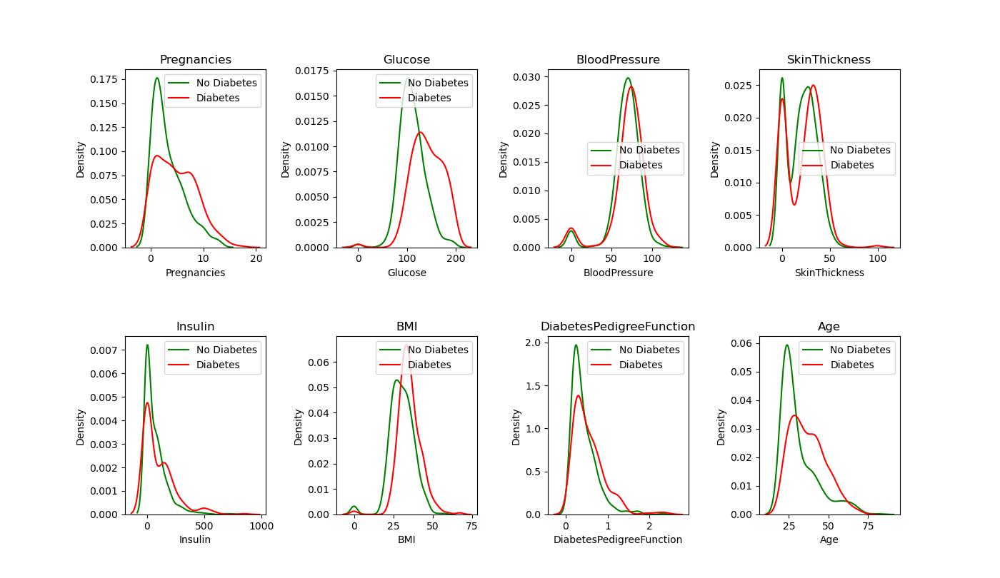
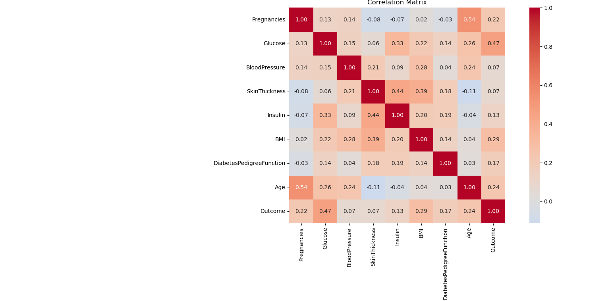
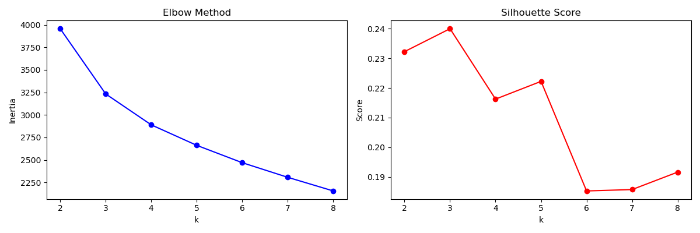
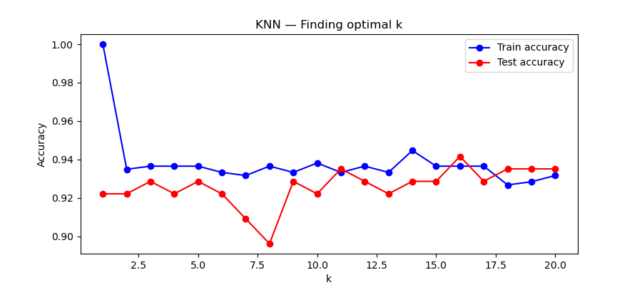
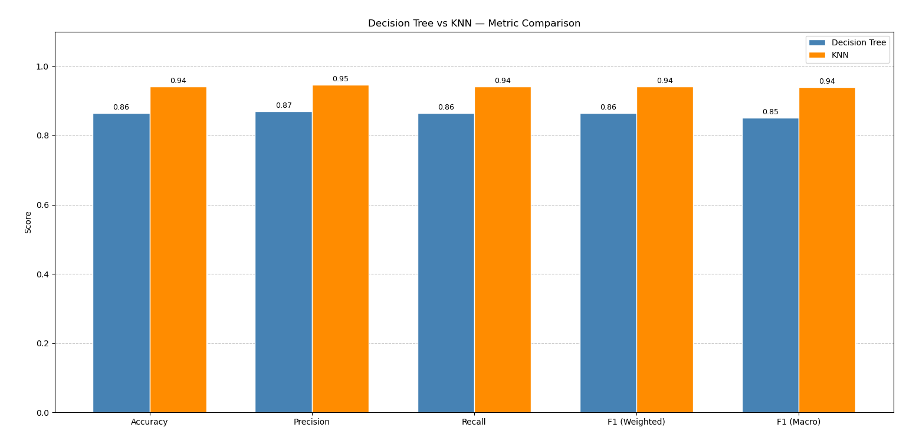
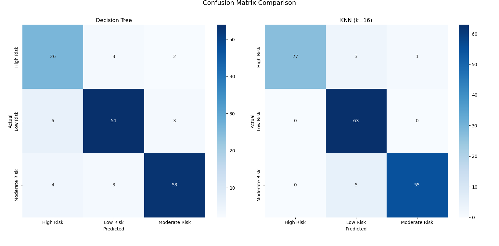

# Patient Disease Risk Stratification System

A classical Machine Learning pipeline that stratifies patients into 3 risk groups for diabetes using Pima Indians Diabetes Dataset. Rather than a simple binary prediction, this systems discovers  natural risk clusters in the data and provides clinically interpretable rules to explain each stratification decision.

## Pipeline Overview
Raw Data -> EDA -> Preprocessing -> PCA -> K-Means -> Decision Tree -> KNN -> Comparison

## Dataset: 

The Pima Indians Diabetes Dataset is sourced from the National Institute of Diabetes and Digestive and Kidney Diseases.
The link to the dataset is :  https://www.kaggle.com/datasets/uciml/pima-indians-diabetes-database.

The dataset contains data on 768 female patients of Pima Indian Heritage and the features of this dataset are: Pregnancies, Glucose, Blood Pressure, SkinThickness, Insulin, BMI, DiabetesPredictionFunction, Age, Outcome(0 = No diabetes, 1 = Diabetes). There are 268 diabetic (35%) patients and 500 non-diabetic (65%) patients.


## Exploratory Data Analysis(EDA)

### Data Quality - Hidden Missing Values
Several features contained biologically zero values, which were treated as missing data:

Feature | Zero Count | Percentage
Glucose | 5 zeros | 0.7%
BMI | 11 zeros | 1.4%
BloodPressure | 35 zeros | 4.6%
SkinThickness | 227 zeros | 29.6%
Insulin | 374 zeros | 48.7%

### Feature Distributions


Glucose, BloodPressure and BMI followed roughly normal distribution. Pregnancies, DiabetesPredictionFunction, Age and Insulin are right skewed.

### Feature Distribution by Outcome




### Key Correlation Findings




#### Preprocessing
Zero values in Glucose, BMI, BloodPressure, SkinThickness, and Insulin were replaced with the median value of their respective column. Median was chosen over mean because some of these features are right-skewed and the mean would be pulled by extreme outliers.

## Principal Component Analysis(PCA)
PCA was implemented from scratch using eigen-decomposition of the scatter matrix. The scree plot showed that top 5 principal components are required to retain 80% variance of the data. Hence the 8-dimensional feature space was reduced to 5 dimensions.

## Kmeans Clustering



The elbow plot showed no sharp bend, indicating that patient risk exists on a continuum rather than having hard boundaries - a clinically realisti finding. The silhouette score peaked at k=3, confirming three distinct risk groups:

Cluster | Risk Label | Diabetes Rate
0 | High Risk | ~ 54%
1 | Low Risk | ~ 50%
2 | Moderate Risk | ~ 16%

The High Risk cluster showed a 3× higher diabetes rate than the Low Risk Cluster - discovered entirely without using the diabetes label during clustering.

## Decision Tree
A decision tree with max depth 4 was trained to classify patients into three risk groups discovered by K-Means. A shallow depth was chosen deliberately to keep the rules clinically interpretable.

## KNN
A KNN classifier was trained on the same task for comparison. Analysis showed peak test accuracy at k=16 neighbors.




## Results

### Metric Comparison



### Confusion Matrices



### Key Findings
KNN achieved higher classification accuracy than Decision Tree, but the Decision Tree provides clinically interpretable IF-THEN rules 

## Future Work -- Deployment Vision
The pipleine can be extended into a clinical decision support tool where a doctor inputs a new patient's details:

```
Glucose: 148,  BMI: 33.6,  Age: 50,  Pregnancies: 6
BloodPressure: 72,  Insulin: 0,  SkinThickness: 35
```

And receives a stratified risk output with explanations:

```
⚠️  Patient Risk Group: HIGH RISK
    Cluster 2 — Older, high glucose, high BMI
    
    Rules that triggered:
    → Glucose > 140
    → BMI > 30
    → Age > 45
    
    Recommendation: Immediate clinical review advised.
```


